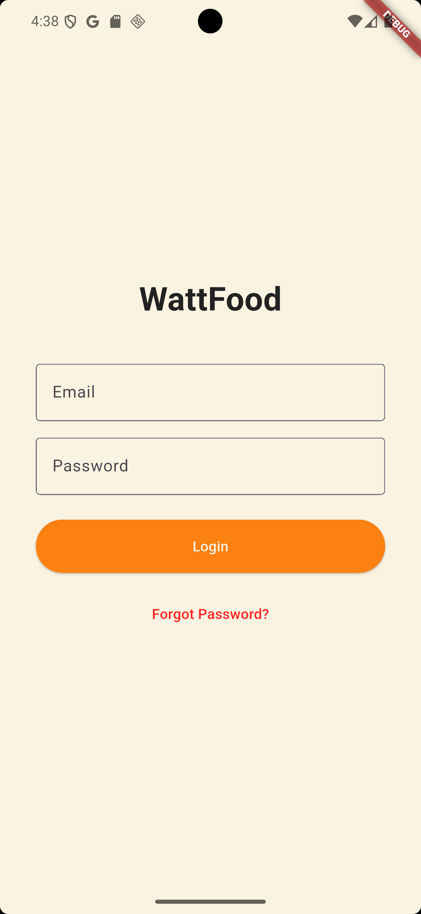
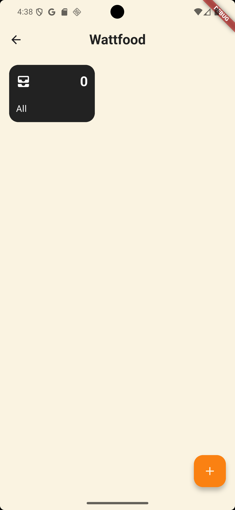
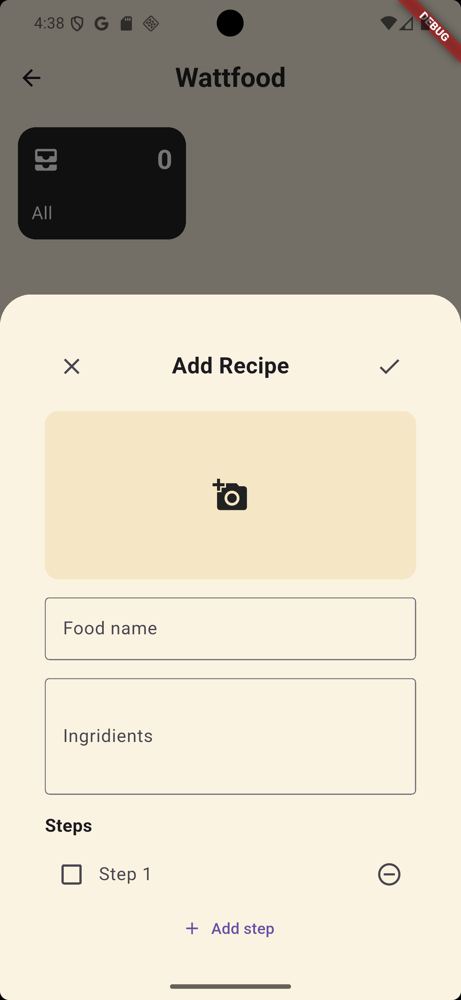
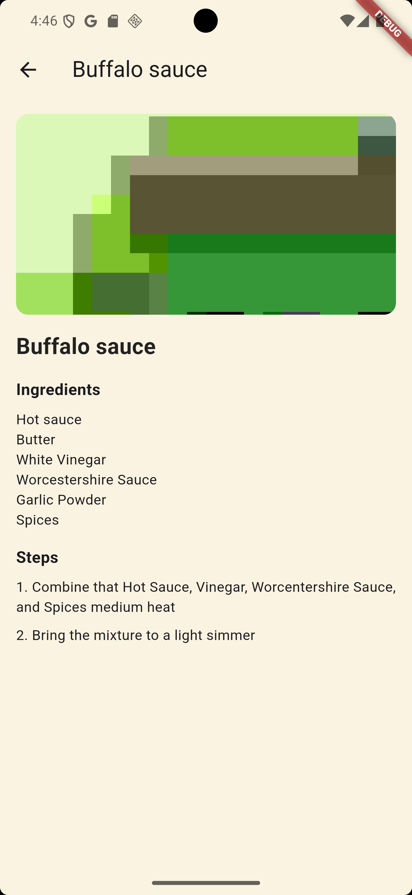
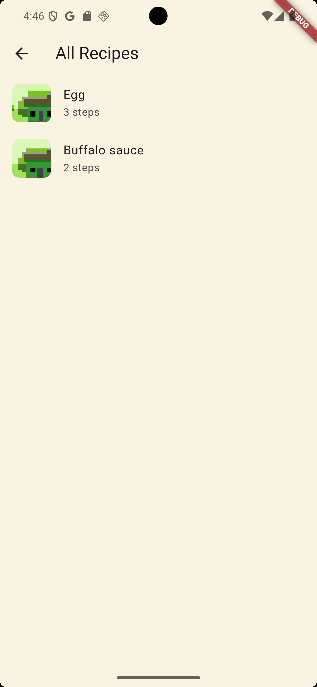

# wattfood

A Flutter project where you can add and save your food recipes for future uses.

In this app I manage to learn Github and explore Claude this is my first AI assisted mobile development

## Screenshots

| Login | Home | Add Recipe |
|---|---|---|
|  |  |  |

| Recipe List | Recipe Detail |
|---|---|
|  |  |

## Getting Started

This project is a starting point for a Flutter application.

A few resources to get you started if this is your first Flutter project:

- [Learn Flutter](https://docs.flutter.dev/get-started/learn-flutter)
- [Write your first Flutter app](https://docs.flutter.dev/get-started/codelab)
- [Flutter learning resources](https://docs.flutter.dev/reference/learning-resources)

For help getting started with Flutter development, view the
[online documentation](https://docs.flutter.dev/), which offers tutorials,
samples, guidance on mobile development, and a full API reference.

